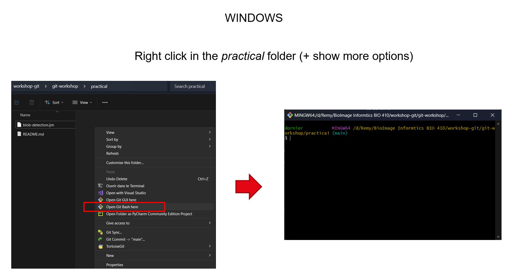
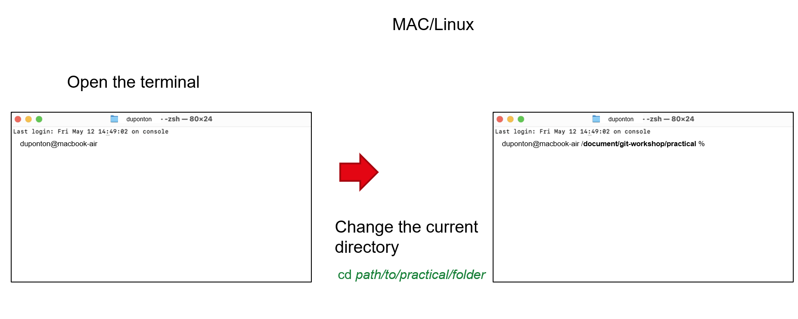
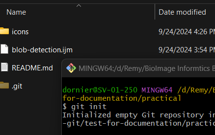
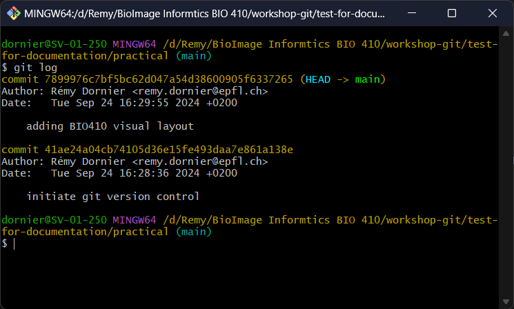
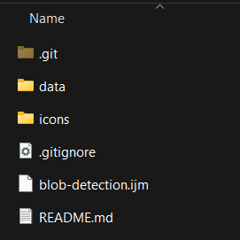

# Practical 1 - Git basics
## Create a git repo

In order to be able to begin the version control of your code/project, you need to initiate the tracking.
1. Under the `practical` folder, open a git terminal
	- on Windows : right-click -> `Open git bash here`
	- on MAC / LINUX : Open the computer terminal and change the current directory to `practical`

<div align="center">
  
    <br>
    
</div>

> *Hint for MAC users :* 
>
> To list directories in the current folder, write down `ls`
> 
> To change the current directory, write down `cd path/to/folder`

2. Configure your git to follow the branch naming convention. 
This convention has recently changed to call 'main' instead of 'master' the default branch of the git repo.
Write down the following command to force git generating the default branch with the name 'main' : `git config --global init.defaultBranch main` 

> This configuration is a global configuration. Once done, you don't have to do it again on this computer. 
But if you change the computer, you'll need to do it again.

3. Write down `git init` in the terminal ; it creates a hidden `.git` folder where commits will be stored.

<div align="center">
  
</div>

## Do your first commit

4. The `practical` folder contains 2 files : an **ImageJ macro** and a **README.md** file. Let's add them in the history.

* On the git terminal, write down `git add .` to add them in the temp buffer.

* Write down `git commit -m "initiate git version control"` to add them in the history

> *Note:* `-m` indicates that you are adding a message to the commit. **It's important to write a clear and concise message** in order
> to know what has been changed. The commits, if the project becomes public or if you collaborate on projects, will be accessible
> by others and they should also be able to understand what has been done thanks to the message you've written.

## Modify the tracked files

5. Under the `practical` folder, open the **README.md** with a text editor (it can be `TextEdit`, `Notepad` or `Notepad++`)
6. The **README** is missing a welcome message. Let's correct it by adding it, with the workshop logo.
Copy the following lines at the very beginning of the **README** and save it.

````
Welcome to the Git & GitLab Workshop !


````
7. Do a commit with a pertinent message (example: *Update README with course visual guidlines*)

## Having a look to the local commits

8. It's important to know what is the last commit you have locally and also to review all the commits you did before a release.
On the terminal, write down `git log`. You should see 2 commits.

> *Hint:* if your have a lot of commits, you can use the <kbd>bottom arrow</kbd> of your keyboard to see more.
> To exit the log view, simply press <kbd>q</kbd>

<div align="center">
  
</div>

## Adding the `.gitignore`

9. There are files that should not be tracked because they are too heavy, they are not relevant for the project or they should not be shared. 
This is typically the case for hidden files like `.DS_Store` or `Thumbs.db` or for data files, like images.

* Under the `practical` folder, create a new file called **.gitignore**

> Note: *Right-click -> New text file* and then rename it as *.gitignore*

* Open this file with a text editor like `Notepad`, `Notepad++` or `TextEdit`

* Add the following list of files to ignore in the **.gitignore** and save it.

````
.DS_Store
Thumbs.db
````

* Move the folder `data` inside the folder `practical`. This folder contains test images for the ImageJ macro.
We don't want images to be tracked by git. So, add this folder in the **.gitignore** and save it.
 
````
/data/
````

* Commit the changes with a pertinent message (ex: "adding gitignore")

<div align="center">
  
	<br>
	Final files and folders
</div>