# Practical 2 - Git and GitLab ; how to make them speak together
## Create a remote repository

In order to host your versioned code on GitLab, you need to have an existing remote project, already created on GitLab.
This project is generally an empty project, with a certain name.

1. Connect to [gitlab.epfl.ch](https://gitlab.epfl.ch) with your EPFL account
2. Select `New project`, then `Create blank project`
3. Give a name to it (ex: `my-first-project-with-git`)

> *Note:* The name you'll give can be different from the one you give to your local project
> but it is a good practice to have it the same locally and remotely.

4. Select the `Private` visibility level, to make this project only visible by you
5. **Uncheck** the configuration `Initialize repository with a README` ; you already have a README in your local project
6. Click on `Create project`

  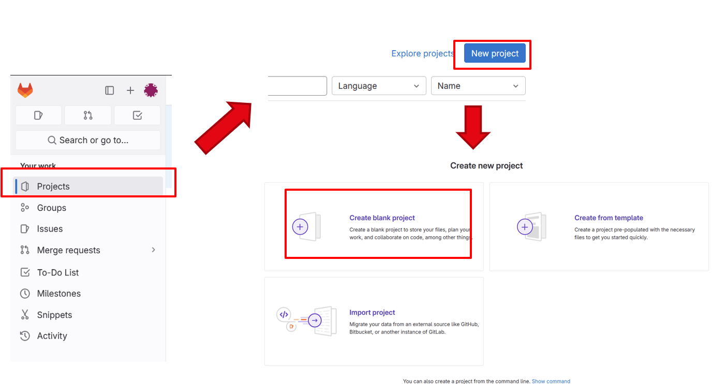
     
    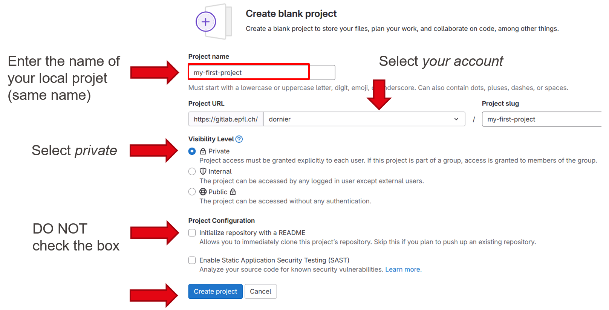

## Link a local project to a GitLab one

Now both projects are initialized, remote one on GitLab, local one in Git, we need to configure the local
Git project to target a specific GitLab project to be able to save/import (i.e. push/pull) code to/from GitLab. 

1. On GitLab, click on the blue `code` menu and copy the URL given by the `Clone with HTTPS` option.

  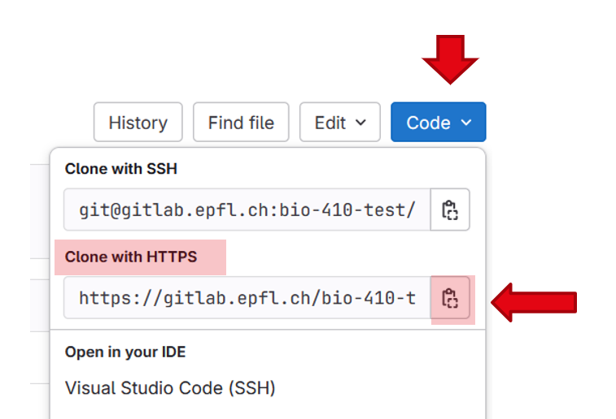

2. In your local projet, under the `practical` folder, open a Git terminal 
3. Write down the following command : `git remote add origin ` and paste the URL.
This command *adds* to the local project a link to a *remote* project in the *origin* channel, given by the *URL*

  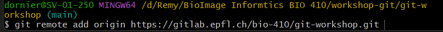

> Note : For Windows users, **ctrl v** doesn't work properly on the git terminal.
You need to do a **right-click -> paste** to paste the URL

4. Check that the remote project was correctly added : `git remote -v`

  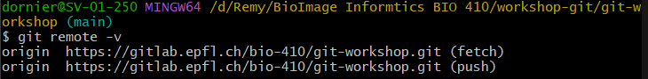

## Push new commits on Gitlab

The `push` action on Git sends all the commits newer than the last one set on GitLab to the GitLab project.
In the two previous section, we've created an empty project on GitLab and have linked it to the local project.

Let's now push the files to gitlab
1. Under the `practical` folder, open a Git terminal 
2. Write down the following command : `git push origin main`.
3. Refresh your GitLab project ; you should now see your files and the different commits.

> Note : It may happen that GitLab asks you some credentials to be able to push/pull/clone a project.
> This is a security feature to link your GitLab account to your computer. Under your account,
> select `Edit profile` and click on `Access tokens`. Create a new token, with the following settings
> - Expiration date : at least 6 months later
> - Read-repository option
> - Write repository option
>
> Once created, copy it and paste it in the `token` field, and add your gaspar username under the `username` field.
>
> 

>  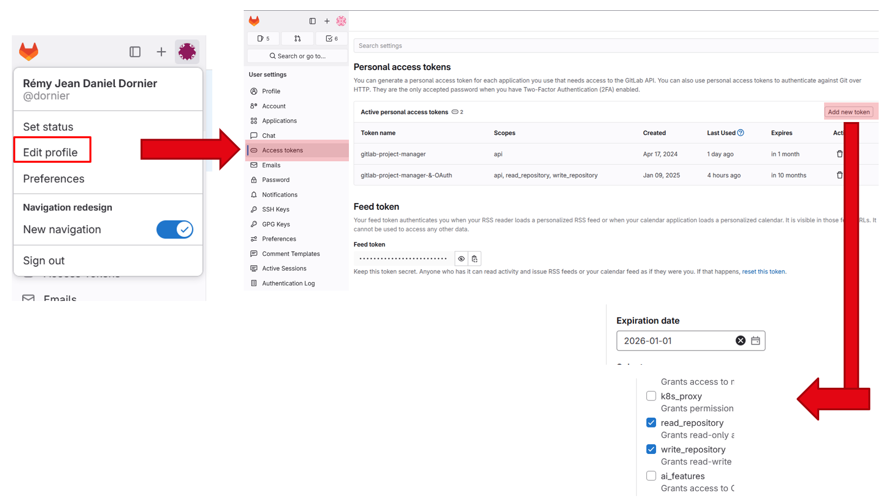
> 

## GitLab interface ; quick summary

### Project summary
1. Project title
2. Permission level
3. Number of commits / branches / tags
4. Project size

  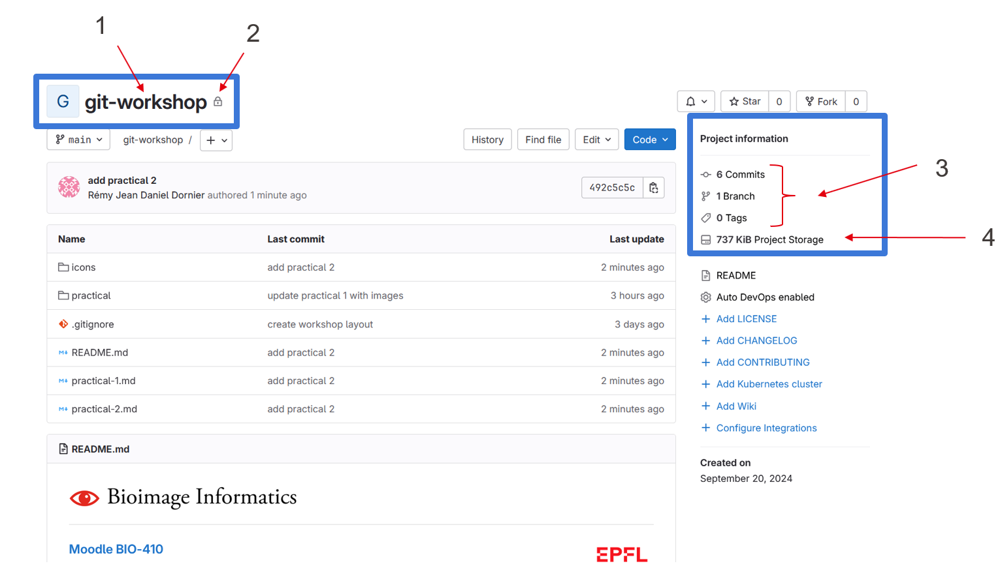

### Commits and download 
1. Last commit
2. History of commits
3. File edition
4. Cloning & downloaded options

  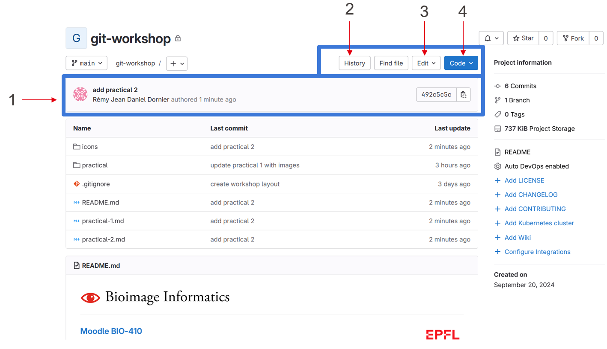

### Code
1. Current branch / commit you are looking at
2. Project files & hierarchy

  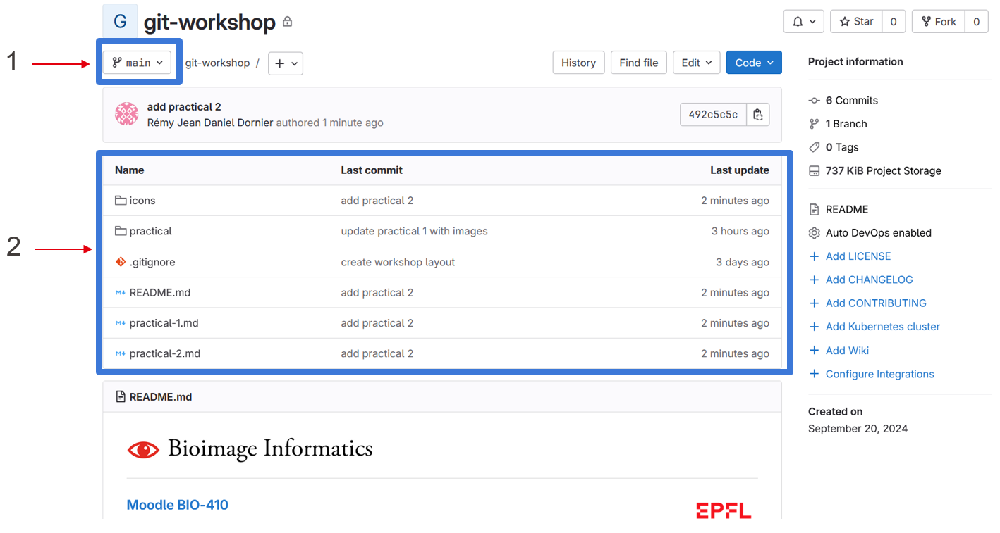

### README preview
1. Automatic preview of the README file

  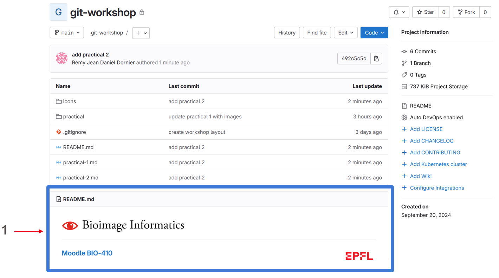

### Project actions and settings
1. Open issues
2. Create merge request
3. Manage permissions on your project, adding collaborators
4. Deploy your code publicly with releases
5. Make some advanced configuration on your project

  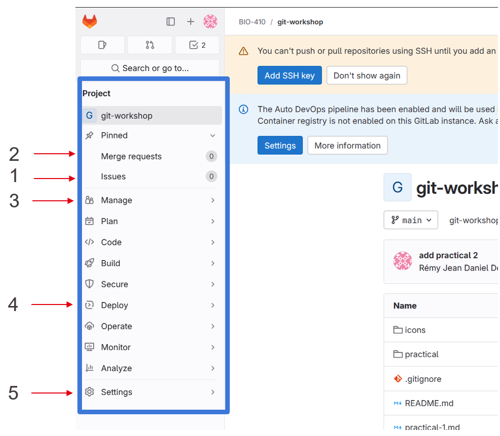

## Editing a file on GitLab
The main file edition which is done directly on GitLab is an update of the README file. The main
reason for that is that you would like to have the most comprehensible and beautiful documentation
and you need for that to see the final preview, which is only available on GitLab.

* Click on the **README** file to open it 
* Under the `Edit` blue menu, select `Edit single file`

  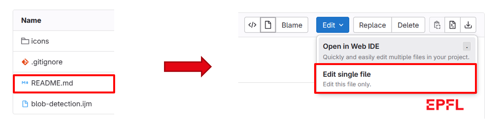

* Enrich the **README** by adding the link to download Fiji `If you don't have Fiji instaleld, 
please download it from [this website](https://imagej.net/software/fiji/)`

  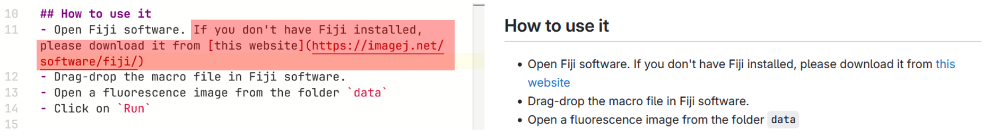

* Click on `Commit changes`

## Pull new commits from GitLab

The `pull` action on Git gets all the commits newer than the last one set locally from the GitLab project.
In the previous section, we've added a new commit on GitLab, which is not added locally yet.
1. Under the `practical` folder, open a Git terminal 
2. Write down the following command : `git pull origin main`.
3. Open the **README.md** file ; you should see the modifications you've done on GitLab.

  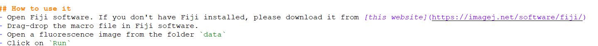

