# Practical 3a - Making a release
## FYI: What is semantic versioning ?
The release process is very important in version control in order to publish stable version of your code.
Each release has a `tag` (i.e. version number), named according a coding convention : the **semantic versioning**.

Here is a short summary of how the version number is built (copied from https://semver.org/)

> Given a version number MAJOR.MINOR.PATCH, increment the:
>
>    - MAJOR version when you make incompatible API changes
>   -  MINOR version when you add functionality in a backward compatible manner
>    - PATCH version when you make backward compatible bug fixes
>
> Additional labels for pre-release and build metadata are available as extensions to the MAJOR.MINOR.PATCH format.

The version number is **unique** and **always defined in ascending order**. You **cannot** release
a version `1.0.1` after the version `1.1.0` is released. The first next version number in that example
is `1.1.1`


## Release your code

Now you've solved conflicts, and you know what is a version number, let's do our first release.
1. On GitLab, check that the latest commit has been pushed. If it is not the case, push your local changes to GitLab.
2. Under the `Deploy` menu, select `Releases` and then `Create a new release`
3. Give a tag (i.e. version number) to the release. As it is the first one, the tag `v1.0.0` is fine.
4. Give a title to the release. The title indicates the major changes you've done to the code and which appear in that release
It is not mandatory, as we usually prefer to put the version number as a title. So, we can leave it blank.
5. Add a description. The description is very important, even if it is not mandatory. All changes that are done
   in the release, even minor ones, should be detailed there, so that everyone is informed.
   In our example, let's put `My first release made with semver, during the git/gitlab workshop`
> The fact that the description is optional is because the release description can also be part of
> the CHANGELOG.md file (not covered by the course).
6. Finally, click on `Create release`

<div align="center">
  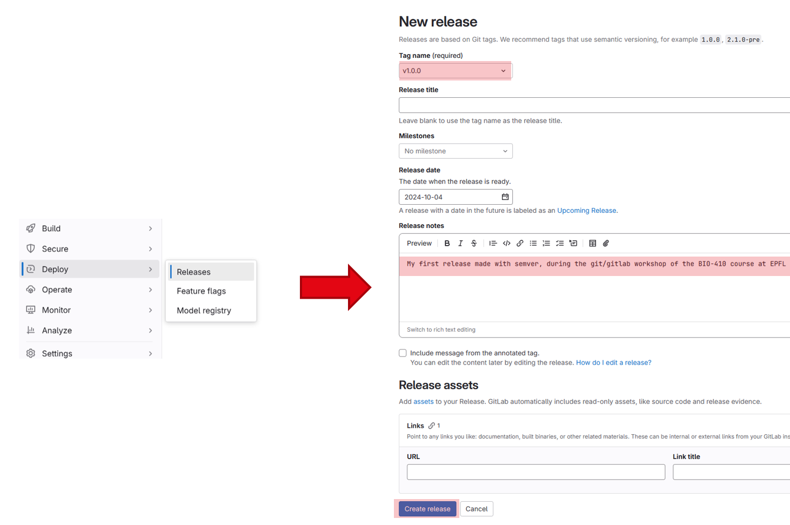
</div>

>Note : To access a release later, you can click on the shortcut in the project information
> <div align="center">
>  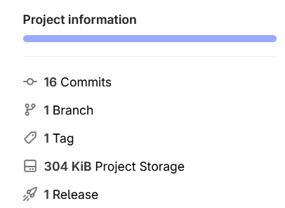
> </div>

## Doing your first bug fix

The code you've released is buggy. Let's first document the bug in an `issue`, the correct it and
finally release the corrected code in a new version.

1. Drag-drop the image called `blobs.tif` on Fiji
2. Open the `blob-detection` macro file on Fiji and run it. Obviously, the result is not the one expected
   (remember that the expected results are shown in the README file).

<div align="center">
  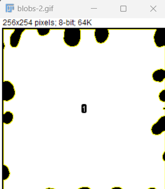
</div>

3. In order to keep track of any bug occurring in a released code, an `issue` is open on GitLab to document it.
   - On GitLab, select `Issues` menu and then click on `New issue`
   - Add a title ; example `blob segmentation fails`. The title has to be meaningful. Do not put `code doesn't work` !
   - Add a description. The description of the bug should be **as precise as possible**, with screenshots if possible,
     to be reproduced by anyone else. You can describe the bug as following, adding a screenshot of result and the raw data.

   ```
   Running the macro on an black-background image gives the following result. Here is the image which causes the bug 
   
   [upload the zip of the raw data](see below)
   
   The blobs are not segmented properly. It seems that's the background which is segmented instead.
   
   [upload the screenshot of the wrong result](see below)
    ```

   - Finally, create the issue by clicking on `Create Issue`. If someone else will have a look to it,
     they will be able to understand and reproduce the bug.
> **Be careful** : When you're posting raw data / screenshot, it is important to **NOT put any confidential data**,
like unpublished images, computer IP address, username/password... because those info will be publicly available

<div align="center">
  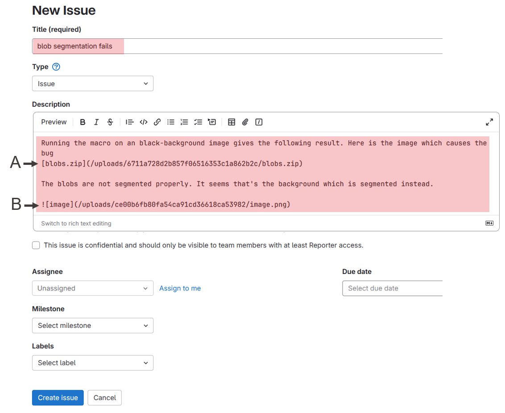
<br>
A. To include a downloadable file, drag-drop a zip file in the edition window.
<br>
B. To display an image, drag-drop a png or jpeg file in the edition window.
</div>

4. Now, let's focus on the bug. The reason of it could be line 10. A contrast inversion is done there and this can lead to that result.
   Comment line 10 and run again the script. The bug disappear.
5. Delete line 10, commit and push changes to GitLab
6. Create a new release, with a new version number `v1.0.1` (i.e. increasing the last digit because it is a bug fix).
   In the release description, mention that you are fixing the bug documented in the issue. For that,
   you can simply add `Fix issue #1`. The issue will be automatically link to your release.

<div align="center">
  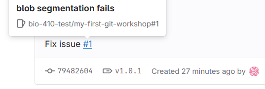
</div>

7. Going back to the issue. Add the following comment saying that you've fixed this bug the new release v1.0.1. Replace the `url/of/the/release` by the real URL.

```
This issue was fixed in version [v1.0.1](url/of/the/release) of the code.
```

> Note: It is a good practice to link the release to the issue, so that everyone know in which release this bug was fixed.

> Note: To get the release URL, you can click on the release itself and copy the URL from the webpage. It should look like this `https://hostname/username/git-workshop/-/releases/v1.0.0`

8. Finally, close the issue.

<div align="center">
  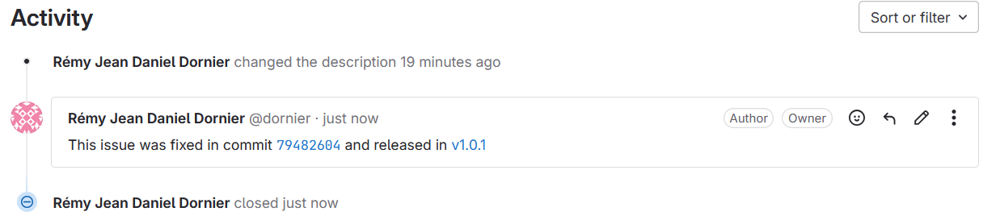
<br>

</div>

# Practical 3b - Working from a public project

It's often that developers contribute to projects that are not their own, or simple want to use a
publicly available template code. In that case, the good practice is to hard-copy this code remotely to
your Gitlab account before starting editing anything. This action is called `forking` a project.

1. Browse the project to fork : https://github.com/BIOP/git-workshop
2. Click on `Forks` and enter
   - The project name ; ex: `git-workshop-nickname`
   - Select your account for the project URL because you want to fork it for you.
   - Select `private` visibility level, as you don't want people to see it (at least for now)
   - Click on `Fork project`

> IMPORTANT : When you fork a public project, you should always check the Licence under which it is released
> before forking it. Depending on which licence it is, it may restrict the usage of the code. So, be careful on
> what you do with the code.
>
> And more generally, when you are using any code from GitLab or GitHub, you should pay attention
> to the licence to know what you can and cannot do with it.


<div align="center">
  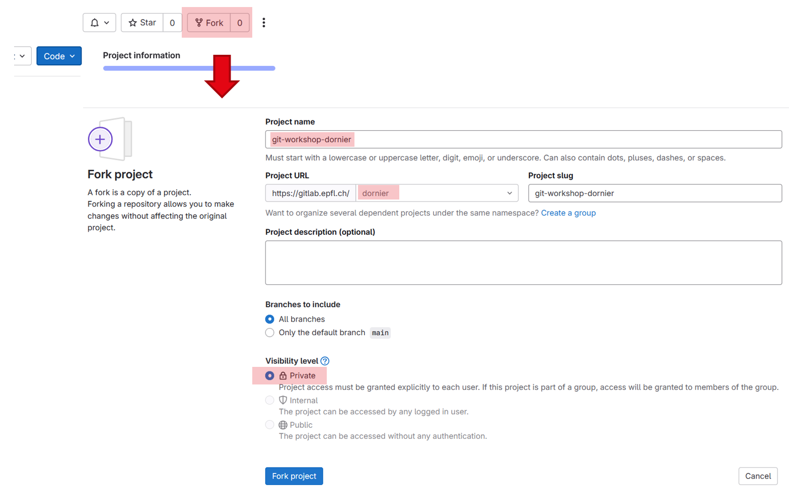
</div>

Now you've forked the code, you need to copy it locally in order to edit it. To copy a remote project
which is not yet on your computer, you have to `clone` it, using `git`.

3. On GitLab, click on the blue `code` menu and copy the URL given by the `Clone with HTTPS` option.

<div align="center">
  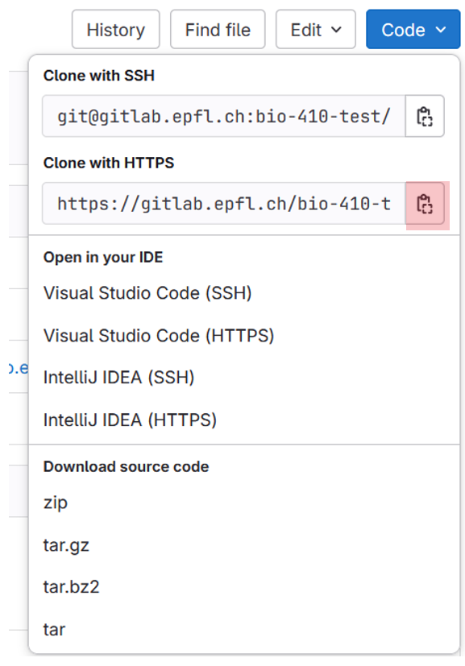
</div>

4. On your computer, open a git terminal where you would like to put the project
5. Enter `git clone ` and paste the copied URL

> Note : For Windows users, `ctrl v` doesn't work properly on the git terminal.
> You need to do a `right-click -> paste` to paste the URL

<div align="center">
  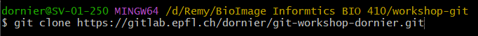
</div>

> Note : It may happen that GitLab asks you some credentials to be able to push/pull/clone a project.
> This is a security feature to link your GitLab account to your computer.
> Follow the below procedure **Linking GitLab to my computer** to set this security feature.
> <div align="center">
>     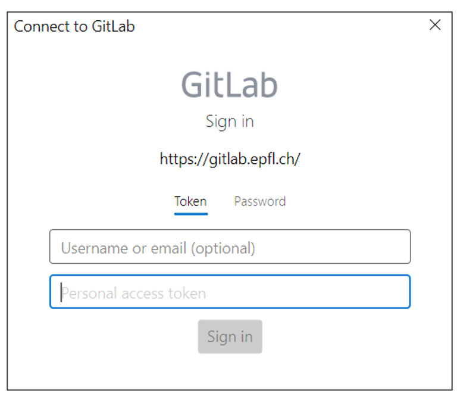
> </div>

Now, you can begin to work on this new project !

### Linking GitLab to my computer

1. Under your account, select `Edit profile`
2. Click on `Access tokens`.

<div align="center">
  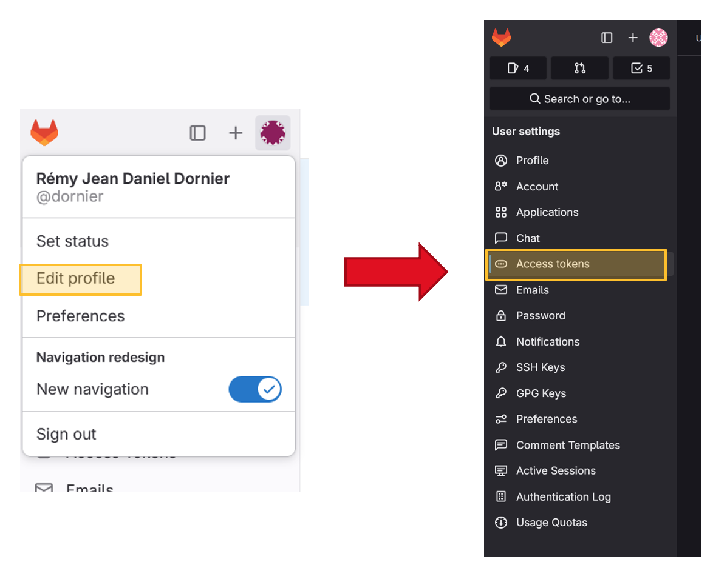
</div>

3. Click on `Add new token` and set the token with the following settings:
   - Give it a name
   - Expiration date : at least 6 months later
   - Read-repository option
   - Write repository option
4. Click on `Create personal access token`

<div align="center">
  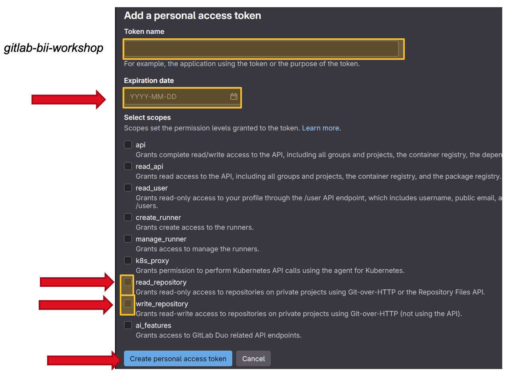
</div>


5. Copy the token

> IMPORTANT: This is the only moment you can copy and you can have access to the token !

<div align="center">
  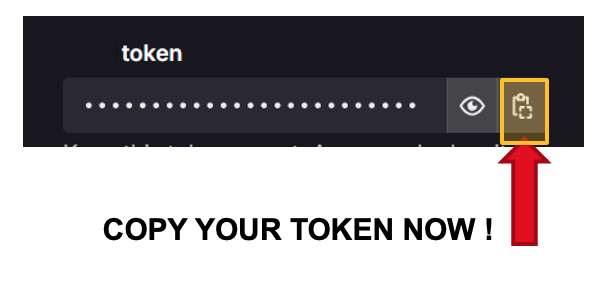
</div>

6. Go back the `Connect to GitLab - Login` window.
7. Enter the following information
- **Username**
- **Personal access token**: paste your token here.
8. Click on `Sign in`.

<div align="center">
  
</div>
