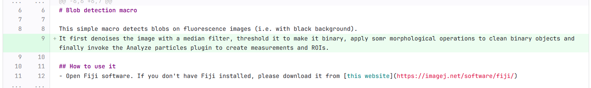
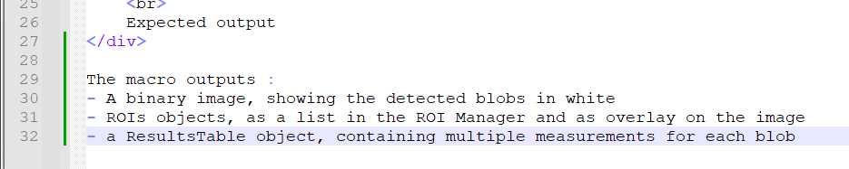
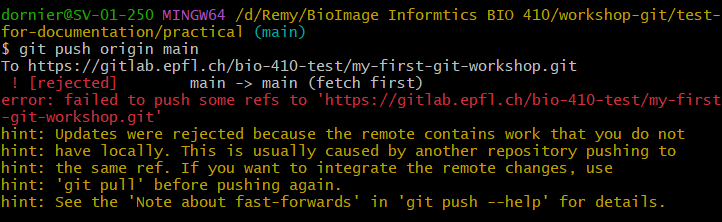
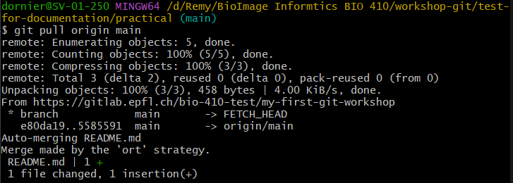
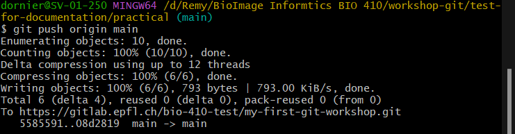
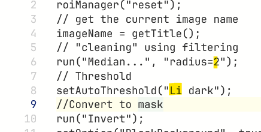
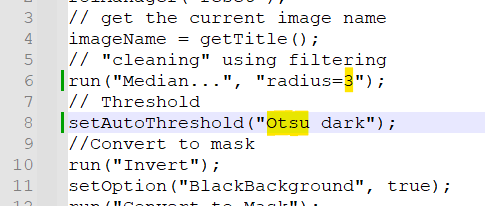
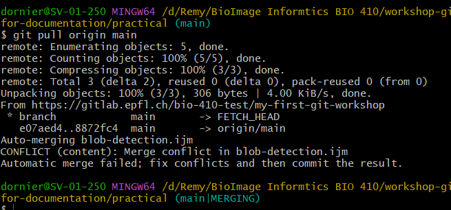
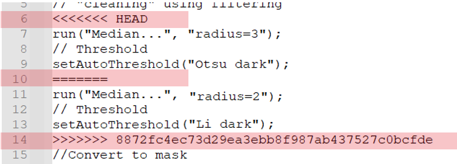

# Extra practical - Manage conflicts
## Conflicts at push

It may happen that you tried to push new commits to GitLab, but it somehow fails.

To solve it, in most cases, you simply need to first pull commits from GitLab, and then redo the push.
But let's simulate that.

1. On GitLab, open the **README.md** file in edition mode.
2. Update it by adding the following short description of the macro
`It first denoises the image with a median filter, 
threshold it to make it binary, apply somr morphological operations to clean binary objects 
and finally invoke the Analyze particles plugin to create measurements and ROIs.`
<div align="center">
  
</div>

3. Commit the changes
4. On your local code, add, at the end of the **README.md** file, the following text
```
The macro outputs : 
- A binary image, showing the detected blobs in white
- ROIs objects, as a list in the ROI Manager and as overlay on the image 
- a ResultsTable object, containing multiple measurements for each blob
```
<div align="center">
  
</div>

5. Commit the changes.
6. Now, try to make a push. It should fail with grace because you have a commit on GitLab that
wasn't yet added to your local history.

<div align="center">
  
</div>

7. Try to do a pull.
<div align="center">
  
</div>

8. Redo the push. It should now work.
<div align="center">
  
</div>

## Conflicts at pull

In the first part, we've seen how to solve an easy conflict. But conflicts are not always so easy to solve.
Especially if conflicts occurred when you try to pull. In that case, it means that the same file
is modified at the same place, but in different commits (at least one locally and one remotely).
This scenario generally occurs when multiple persons collaborate on the same project.

In this part, we'll simulate a collaboration on the `blob-detection` macro file, to create a conflict,
and we'll see how to solve it.

1. Open the macro file **locally** and edit it as following
   - Change the median radius to `3`
   - Change the thresholding method to `Otsu dark`
   - Commit changes

<div align="center">
  
</div>

2. On **GitLab**, open and edit the macro file as following
   - Change the median radius to `2`
   - Change the thresholding method to `Li dark`
   - Commit changes

<div align="center">
  
</div>

3. From the first part, you've learnt to first pull commits from GitLab before pushing the ones locally.
So, try to do a `git pull origin main`. Git terminal should display a conflict message like the one below.

<div align="center">
  
</div>

4. In order to solve it, you have to open each file in conflict and manually choose what code
you would like to keep and what code you would like to discard.
- Open the `blob-detection` macro file. You should see added lines showing you which part is in conflict.
 The code in between `HEAD` and `===` corresponds to the **local** code and the one in between
`===` and `8872fc...` corresponds to the `remote` code.

<div align="center">
  
</div>

- Delete first the code you would like to discard (i.e. the remote code on lines 11-13) and then delete the highlighted lines
- Commit changes (we generally put as commit message `solving conflicts` or similar)

> Note : The way to solve conflicts we presented there is a very manual way. The goal was to 
> make you aware of what happens when such conflict occurs. In most projects, you'll use an IDE
> to create your code and conflict solving will be a little bit easier (you'll still have to
> manually choose between the remote and local code but everything is nicely handled in a 
> dedicated window). We'll cover the resolution of conflicts using the IDE in the next workshop
> on IntelliJ.