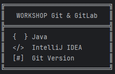
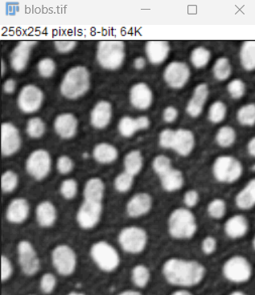
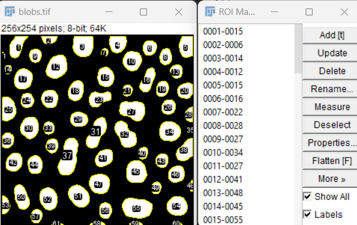

Welcome to the Git & GitLab Workshop !

# Blob detection macro

This simple macro detects blobs on fluorescence images (i.e. with black background).

## How to use it
- Open Fiji software
- Drag-drop the macro file in Fiji software.
- Open a fluorescence image from the folder `data`
- Click on `Run`

## Expected output

 
     
    Input image
     
     
  
     
    Expected output

